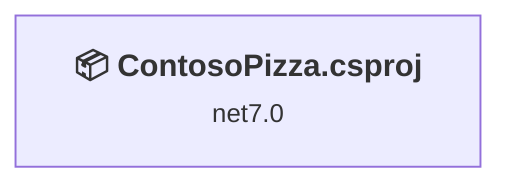
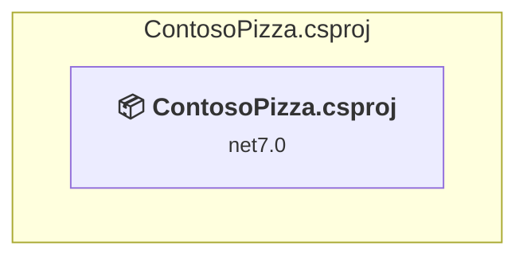

# Projects and dependencies analysis

This document provides a comprehensive overview of the projects and their dependencies in the context of upgrading to .NETCoreApp,Version=v8.0.

## Table of Contents

- [Executive Summary](#executive-Summary)
  - [Highlevel Metrics](#highlevel-metrics)
  - [Projects Compatibility](#projects-compatibility)
  - [Package Compatibility](#package-compatibility)
  - [API Compatibility](#api-compatibility)
  - [Binding Redirect Configuration](#binding-redirect-configuration)
- [Aggregate NuGet packages details](#aggregate-nuget-packages-details)
- [Top API Migration Challenges](#top-api-migration-challenges)
  - [Technologies and Features](#technologies-and-features)
  - [Most Frequent API Issues](#most-frequent-api-issues)
- [Projects Relationship Graph](#projects-relationship-graph)
- [Project Details](#project-details)

  - [ContosoPizza\ContosoPizza.csproj](#contosopizzacontosopizzacsproj)

## Executive Summary

### Highlevel Metrics

| Metric | Count | Status |
| :--- | :---: | :--- |
| Total Projects | 1 | All require upgrade |
| Total NuGet Packages | 168 | 3 need upgrade |
| Total Code Files | 17 |  |
| Total Code Files with Incidents | 1 |  |
| Total Lines of Code | 409 |  |
| Total Number of Issues | 4 |  |
| Estimated LOC to modify | 0+ | at least 0.0% of codebase |

### Projects Compatibility

| Project | Target Framework | Difficulty | Package Issues | API Issues | Binding Issues | Est. LOC Impact | Description |
| :--- | :---: | :---: | :---: | :---: | :---: | :---: | :--- |
| [ContosoPizza\ContosoPizza.csproj](#contosopizzacontosopizzacsproj) | net7.0 | 🟢 Low | 3 | 0 | 0 |  | AspNetCore, Sdk Style = True |

### Package Compatibility

| Status | Count | Percentage |
| :--- | :---: | :---: |
| ✅ Compatible | 165 | 98.2% |
| ⚠️ Incompatible | 0 | 0.0% |
| 🔄 Upgrade Recommended | 3 | 1.8% |
| ***Total NuGet Packages*** | ***168*** | ***100%*** |

### API Compatibility

| Category | Count | Impact |
| :--- | :---: | :--- |
| 🔴 Binary Incompatible | 0 | High - Require code changes |
| 🟡 Source Incompatible | 0 | Medium - Needs re-compilation and potential conflicting API error fixing |
| 🔵 Behavioral change | 0 | Low - Behavioral changes that may require testing at runtime |
| ✅ Compatible | 1310 |  |
| ***Total APIs Analyzed*** | ***1310*** |  |

## Aggregate NuGet packages details

| Package | Current Version | Suggested Version | Projects | Description |
| :--- | :---: | :---: | :--- | :--- |
| Humanizer.Core | 2.14.1 |  | [ContosoPizza.csproj](#contosopizzacontosopizzacsproj) | ✅Compatible |
| Microsoft.AspNetCore.Razor.Language | 6.0.11 |  | [ContosoPizza.csproj](#contosopizzacontosopizzacsproj) | ✅Compatible |
| Microsoft.Bcl.AsyncInterfaces | 6.0.0 |  | [ContosoPizza.csproj](#contosopizzacontosopizzacsproj) | ✅Compatible |
| Microsoft.Build | 17.3.2 |  | [ContosoPizza.csproj](#contosopizzacontosopizzacsproj) | ✅Compatible |
| Microsoft.Build.Framework | 17.3.2 |  | [ContosoPizza.csproj](#contosopizzacontosopizzacsproj) | ✅Compatible |
| Microsoft.CodeAnalysis.Analyzers | 3.3.3 |  | [ContosoPizza.csproj](#contosopizzacontosopizzacsproj) | ✅Compatible |
| Microsoft.CodeAnalysis.AnalyzerUtilities | 3.3.0 |  | [ContosoPizza.csproj](#contosopizzacontosopizzacsproj) | ✅Compatible |
| Microsoft.CodeAnalysis.Common | 4.4.0 |  | [ContosoPizza.csproj](#contosopizzacontosopizzacsproj) | ✅Compatible |
| Microsoft.CodeAnalysis.CSharp | 4.4.0 |  | [ContosoPizza.csproj](#contosopizzacontosopizzacsproj) | ✅Compatible |
| Microsoft.CodeAnalysis.CSharp.Features | 4.4.0 |  | [ContosoPizza.csproj](#contosopizzacontosopizzacsproj) | ✅Compatible |
| Microsoft.CodeAnalysis.CSharp.Scripting | 4.4.0 |  | [ContosoPizza.csproj](#contosopizzacontosopizzacsproj) | ✅Compatible |
| Microsoft.CodeAnalysis.CSharp.Workspaces | 4.4.0 |  | [ContosoPizza.csproj](#contosopizzacontosopizzacsproj) | ✅Compatible |
| Microsoft.CodeAnalysis.Elfie | 1.0.0 |  | [ContosoPizza.csproj](#contosopizzacontosopizzacsproj) | ✅Compatible |
| Microsoft.CodeAnalysis.Features | 4.4.0 |  | [ContosoPizza.csproj](#contosopizzacontosopizzacsproj) | ✅Compatible |
| Microsoft.CodeAnalysis.Razor | 6.0.11 |  | [ContosoPizza.csproj](#contosopizzacontosopizzacsproj) | ✅Compatible |
| Microsoft.CodeAnalysis.Scripting.Common | 4.4.0 |  | [ContosoPizza.csproj](#contosopizzacontosopizzacsproj) | ✅Compatible |
| Microsoft.CodeAnalysis.VisualBasic | 4.4.0 |  | [ContosoPizza.csproj](#contosopizzacontosopizzacsproj) | ✅Compatible |
| Microsoft.CodeAnalysis.VisualBasic.Features | 4.4.0 |  | [ContosoPizza.csproj](#contosopizzacontosopizzacsproj) | ✅Compatible |
| Microsoft.CodeAnalysis.VisualBasic.Workspaces | 4.4.0 |  | [ContosoPizza.csproj](#contosopizzacontosopizzacsproj) | ✅Compatible |
| Microsoft.CodeAnalysis.Workspaces.Common | 4.4.0 |  | [ContosoPizza.csproj](#contosopizzacontosopizzacsproj) | ✅Compatible |
| Microsoft.CodeAnalysis.Workspaces.MSBuild | 4.4.0 |  | [ContosoPizza.csproj](#contosopizzacontosopizzacsproj) | ✅Compatible |
| Microsoft.CSharp | 4.7.0 |  | [ContosoPizza.csproj](#contosopizzacontosopizzacsproj) | ✅Compatible |
| Microsoft.Data.Sqlite.Core | 7.0.5 |  | [ContosoPizza.csproj](#contosopizzacontosopizzacsproj) | ✅Compatible |
| Microsoft.DiaSymReader | 1.4.0 |  | [ContosoPizza.csproj](#contosopizzacontosopizzacsproj) | ✅Compatible |
| Microsoft.DotNet.Scaffolding.Shared | 7.0.6 |  | [ContosoPizza.csproj](#contosopizzacontosopizzacsproj) | ✅Compatible |
| Microsoft.EntityFrameworkCore | 7.0.5 |  | [ContosoPizza.csproj](#contosopizzacontosopizzacsproj) | ✅Compatible |
| Microsoft.EntityFrameworkCore.Abstractions | 7.0.5 |  | [ContosoPizza.csproj](#contosopizzacontosopizzacsproj) | ✅Compatible |
| Microsoft.EntityFrameworkCore.Analyzers | 7.0.5 |  | [ContosoPizza.csproj](#contosopizzacontosopizzacsproj) | ✅Compatible |
| Microsoft.EntityFrameworkCore.Design | 7.0.5 |  | [ContosoPizza.csproj](#contosopizzacontosopizzacsproj) | ✅Compatible |
| Microsoft.EntityFrameworkCore.Relational | 7.0.5 |  | [ContosoPizza.csproj](#contosopizzacontosopizzacsproj) | ✅Compatible |
| Microsoft.EntityFrameworkCore.Sqlite | 7.0.5 | 8.0.31 | [ContosoPizza.csproj](#contosopizzacontosopizzacsproj) | NuGet package upgrade is recommended |
| Microsoft.EntityFrameworkCore.Sqlite.Core | 7.0.5 |  | [ContosoPizza.csproj](#contosopizzacontosopizzacsproj) | ✅Compatible |
| Microsoft.EntityFrameworkCore.Tools | 7.0.5 | 8.0.31 | [ContosoPizza.csproj](#contosopizzacontosopizzacsproj) | NuGet package upgrade is recommended |
| Microsoft.Extensions.Caching.Abstractions | 7.0.0 |  | [ContosoPizza.csproj](#contosopizzacontosopizzacsproj) | ✅Compatible |
| Microsoft.Extensions.Caching.Memory | 7.0.0 |  | [ContosoPizza.csproj](#contosopizzacontosopizzacsproj) | ✅Compatible |
| Microsoft.Extensions.Configuration.Abstractions | 7.0.0 |  | [ContosoPizza.csproj](#contosopizzacontosopizzacsproj) | ✅Compatible |
| Microsoft.Extensions.DependencyInjection | 7.0.0 |  | [ContosoPizza.csproj](#contosopizzacontosopizzacsproj) | ✅Compatible |
| Microsoft.Extensions.DependencyInjection.Abstractions | 7.0.0 |  | [ContosoPizza.csproj](#contosopizzacontosopizzacsproj) | ✅Compatible |
| Microsoft.Extensions.DependencyModel | 7.0.0 |  | [ContosoPizza.csproj](#contosopizzacontosopizzacsproj) | ✅Compatible |
| Microsoft.Extensions.Logging | 7.0.0 |  | [ContosoPizza.csproj](#contosopizzacontosopizzacsproj) | ✅Compatible |
| Microsoft.Extensions.Logging.Abstractions | 7.0.0 |  | [ContosoPizza.csproj](#contosopizzacontosopizzacsproj) | ✅Compatible |
| Microsoft.Extensions.Options | 7.0.0 |  | [ContosoPizza.csproj](#contosopizzacontosopizzacsproj) | ✅Compatible |
| Microsoft.Extensions.Primitives | 7.0.0 |  | [ContosoPizza.csproj](#contosopizzacontosopizzacsproj) | ✅Compatible |
| Microsoft.NET.StringTools | 17.3.2 |  | [ContosoPizza.csproj](#contosopizzacontosopizzacsproj) | ✅Compatible |
| Microsoft.NETCore.Platforms | 1.1.1 |  | [ContosoPizza.csproj](#contosopizzacontosopizzacsproj) | ✅Compatible |
| Microsoft.NETCore.Targets | 1.1.3 |  | [ContosoPizza.csproj](#contosopizzacontosopizzacsproj) | ✅Compatible |
| Microsoft.VisualStudio.Web.CodeGeneration | 7.0.6 |  | [ContosoPizza.csproj](#contosopizzacontosopizzacsproj) | ✅Compatible |
| Microsoft.VisualStudio.Web.CodeGeneration.Core | 7.0.6 |  | [ContosoPizza.csproj](#contosopizzacontosopizzacsproj) | ✅Compatible |
| Microsoft.VisualStudio.Web.CodeGeneration.Design | 7.0.6 | 8.0.23 | [ContosoPizza.csproj](#contosopizzacontosopizzacsproj) | NuGet package upgrade is recommended |
| Microsoft.VisualStudio.Web.CodeGeneration.EntityFrameworkCore | 7.0.6 |  | [ContosoPizza.csproj](#contosopizzacontosopizzacsproj) | ✅Compatible |
| Microsoft.VisualStudio.Web.CodeGeneration.Templating | 7.0.6 |  | [ContosoPizza.csproj](#contosopizzacontosopizzacsproj) | ✅Compatible |
| Microsoft.VisualStudio.Web.CodeGeneration.Utils | 7.0.6 |  | [ContosoPizza.csproj](#contosopizzacontosopizzacsproj) | ✅Compatible |
| Microsoft.VisualStudio.Web.CodeGenerators.Mvc | 7.0.6 |  | [ContosoPizza.csproj](#contosopizzacontosopizzacsproj) | ✅Compatible |
| Microsoft.Win32.Primitives | 4.3.0 |  | [ContosoPizza.csproj](#contosopizzacontosopizzacsproj) | ✅Compatible |
| Microsoft.Win32.SystemEvents | 6.0.0 |  | [ContosoPizza.csproj](#contosopizzacontosopizzacsproj) | ✅Compatible |
| Mono.TextTemplating | 2.2.1 |  | [ContosoPizza.csproj](#contosopizzacontosopizzacsproj) | ✅Compatible |
| NETStandard.Library | 1.6.1 |  | [ContosoPizza.csproj](#contosopizzacontosopizzacsproj) | ✅Compatible |
| Newtonsoft.Json | 13.0.1 |  | [ContosoPizza.csproj](#contosopizzacontosopizzacsproj) | ✅Compatible |
| NuGet.Common | 6.3.1 |  | [ContosoPizza.csproj](#contosopizzacontosopizzacsproj) | ✅Compatible |
| NuGet.Configuration | 6.3.1 |  | [ContosoPizza.csproj](#contosopizzacontosopizzacsproj) | ✅Compatible |
| NuGet.DependencyResolver.Core | 6.3.1 |  | [ContosoPizza.csproj](#contosopizzacontosopizzacsproj) | ✅Compatible |
| NuGet.Frameworks | 6.3.1 |  | [ContosoPizza.csproj](#contosopizzacontosopizzacsproj) | ✅Compatible |
| NuGet.LibraryModel | 6.3.1 |  | [ContosoPizza.csproj](#contosopizzacontosopizzacsproj) | ✅Compatible |
| NuGet.Packaging | 6.3.1 |  | [ContosoPizza.csproj](#contosopizzacontosopizzacsproj) | ✅Compatible |
| NuGet.ProjectModel | 6.3.1 |  | [ContosoPizza.csproj](#contosopizzacontosopizzacsproj) | ✅Compatible |
| NuGet.Protocol | 6.3.1 |  | [ContosoPizza.csproj](#contosopizzacontosopizzacsproj) | ✅Compatible |
| NuGet.Versioning | 6.3.1 |  | [ContosoPizza.csproj](#contosopizzacontosopizzacsproj) | ✅Compatible |
| runtime.debian.8-x64.runtime.native.System.Security.Cryptography.OpenSsl | 4.3.0 |  | [ContosoPizza.csproj](#contosopizzacontosopizzacsproj) | ✅Compatible |
| runtime.fedora.23-x64.runtime.native.System.Security.Cryptography.OpenSsl | 4.3.0 |  | [ContosoPizza.csproj](#contosopizzacontosopizzacsproj) | ✅Compatible |
| runtime.fedora.24-x64.runtime.native.System.Security.Cryptography.OpenSsl | 4.3.0 |  | [ContosoPizza.csproj](#contosopizzacontosopizzacsproj) | ✅Compatible |
| runtime.native.System | 4.3.0 |  | [ContosoPizza.csproj](#contosopizzacontosopizzacsproj) | ✅Compatible |
| runtime.native.System.IO.Compression | 4.3.0 |  | [ContosoPizza.csproj](#contosopizzacontosopizzacsproj) | ✅Compatible |
| runtime.native.System.Net.Http | 4.3.0 |  | [ContosoPizza.csproj](#contosopizzacontosopizzacsproj) | ✅Compatible |
| runtime.native.System.Security.Cryptography.Apple | 4.3.0 |  | [ContosoPizza.csproj](#contosopizzacontosopizzacsproj) | ✅Compatible |
| runtime.native.System.Security.Cryptography.OpenSsl | 4.3.0 |  | [ContosoPizza.csproj](#contosopizzacontosopizzacsproj) | ✅Compatible |
| runtime.opensuse.13.2-x64.runtime.native.System.Security.Cryptography.OpenSsl | 4.3.0 |  | [ContosoPizza.csproj](#contosopizzacontosopizzacsproj) | ✅Compatible |
| runtime.opensuse.42.1-x64.runtime.native.System.Security.Cryptography.OpenSsl | 4.3.0 |  | [ContosoPizza.csproj](#contosopizzacontosopizzacsproj) | ✅Compatible |
| runtime.osx.10.10-x64.runtime.native.System.Security.Cryptography.Apple | 4.3.0 |  | [ContosoPizza.csproj](#contosopizzacontosopizzacsproj) | ✅Compatible |
| runtime.osx.10.10-x64.runtime.native.System.Security.Cryptography.OpenSsl | 4.3.0 |  | [ContosoPizza.csproj](#contosopizzacontosopizzacsproj) | ✅Compatible |
| runtime.rhel.7-x64.runtime.native.System.Security.Cryptography.OpenSsl | 4.3.0 |  | [ContosoPizza.csproj](#contosopizzacontosopizzacsproj) | ✅Compatible |
| runtime.ubuntu.14.04-x64.runtime.native.System.Security.Cryptography.OpenSsl | 4.3.0 |  | [ContosoPizza.csproj](#contosopizzacontosopizzacsproj) | ✅Compatible |
| runtime.ubuntu.16.04-x64.runtime.native.System.Security.Cryptography.OpenSsl | 4.3.0 |  | [ContosoPizza.csproj](#contosopizzacontosopizzacsproj) | ✅Compatible |
| runtime.ubuntu.16.10-x64.runtime.native.System.Security.Cryptography.OpenSsl | 4.3.0 |  | [ContosoPizza.csproj](#contosopizzacontosopizzacsproj) | ✅Compatible |
| SQLitePCLRaw.bundle_e_sqlite3 | 2.1.4 |  | [ContosoPizza.csproj](#contosopizzacontosopizzacsproj) | ✅Compatible |
| SQLitePCLRaw.core | 2.1.4 |  | [ContosoPizza.csproj](#contosopizzacontosopizzacsproj) | ✅Compatible |
| SQLitePCLRaw.lib.e_sqlite3 | 2.1.4 |  | [ContosoPizza.csproj](#contosopizzacontosopizzacsproj) | ✅Compatible |
| SQLitePCLRaw.provider.e_sqlite3 | 2.1.4 |  | [ContosoPizza.csproj](#contosopizzacontosopizzacsproj) | ✅Compatible |
| System.AppContext | 4.3.0 |  | [ContosoPizza.csproj](#contosopizzacontosopizzacsproj) | ✅Compatible |
| System.Buffers | 4.3.0 |  | [ContosoPizza.csproj](#contosopizzacontosopizzacsproj) | ✅Compatible |
| System.CodeDom | 4.4.0 |  | [ContosoPizza.csproj](#contosopizzacontosopizzacsproj) | ✅Compatible |
| System.Collections | 4.3.0 |  | [ContosoPizza.csproj](#contosopizzacontosopizzacsproj) | ✅Compatible |
| System.Collections.Concurrent | 4.3.0 |  | [ContosoPizza.csproj](#contosopizzacontosopizzacsproj) | ✅Compatible |
| System.Collections.Immutable | 6.0.0 |  | [ContosoPizza.csproj](#contosopizzacontosopizzacsproj) | ✅Compatible |
| System.Composition | 6.0.0 |  | [ContosoPizza.csproj](#contosopizzacontosopizzacsproj) | ✅Compatible |
| System.Composition.AttributedModel | 6.0.0 |  | [ContosoPizza.csproj](#contosopizzacontosopizzacsproj) | ✅Compatible |
| System.Composition.Convention | 6.0.0 |  | [ContosoPizza.csproj](#contosopizzacontosopizzacsproj) | ✅Compatible |
| System.Composition.Hosting | 6.0.0 |  | [ContosoPizza.csproj](#contosopizzacontosopizzacsproj) | ✅Compatible |
| System.Composition.Runtime | 6.0.0 |  | [ContosoPizza.csproj](#contosopizzacontosopizzacsproj) | ✅Compatible |
| System.Composition.TypedParts | 6.0.0 |  | [ContosoPizza.csproj](#contosopizzacontosopizzacsproj) | ✅Compatible |
| System.Configuration.ConfigurationManager | 6.0.0 |  | [ContosoPizza.csproj](#contosopizzacontosopizzacsproj) | ✅Compatible |
| System.Console | 4.3.0 |  | [ContosoPizza.csproj](#contosopizzacontosopizzacsproj) | ✅Compatible |
| System.Data.DataSetExtensions | 4.5.0 |  | [ContosoPizza.csproj](#contosopizzacontosopizzacsproj) | ✅Compatible |
| System.Diagnostics.Debug | 4.3.0 |  | [ContosoPizza.csproj](#contosopizzacontosopizzacsproj) | ✅Compatible |
| System.Diagnostics.DiagnosticSource | 4.3.0 |  | [ContosoPizza.csproj](#contosopizzacontosopizzacsproj) | ✅Compatible |
| System.Diagnostics.Tools | 4.3.0 |  | [ContosoPizza.csproj](#contosopizzacontosopizzacsproj) | ✅Compatible |
| System.Diagnostics.Tracing | 4.3.0 |  | [ContosoPizza.csproj](#contosopizzacontosopizzacsproj) | ✅Compatible |
| System.Drawing.Common | 6.0.0 |  | [ContosoPizza.csproj](#contosopizzacontosopizzacsproj) | ✅Compatible |
| System.Formats.Asn1 | 5.0.0 |  | [ContosoPizza.csproj](#contosopizzacontosopizzacsproj) | ✅Compatible |
| System.Globalization | 4.3.0 |  | [ContosoPizza.csproj](#contosopizzacontosopizzacsproj) | ✅Compatible |
| System.Globalization.Calendars | 4.3.0 |  | [ContosoPizza.csproj](#contosopizzacontosopizzacsproj) | ✅Compatible |
| System.Globalization.Extensions | 4.3.0 |  | [ContosoPizza.csproj](#contosopizzacontosopizzacsproj) | ✅Compatible |
| System.IO | 4.3.0 |  | [ContosoPizza.csproj](#contosopizzacontosopizzacsproj) | ✅Compatible |
| System.IO.Compression | 4.3.0 |  | [ContosoPizza.csproj](#contosopizzacontosopizzacsproj) | ✅Compatible |
| System.IO.Compression.ZipFile | 4.3.0 |  | [ContosoPizza.csproj](#contosopizzacontosopizzacsproj) | ✅Compatible |
| System.IO.FileSystem | 4.3.0 |  | [ContosoPizza.csproj](#contosopizzacontosopizzacsproj) | ✅Compatible |
| System.IO.FileSystem.Primitives | 4.3.0 |  | [ContosoPizza.csproj](#contosopizzacontosopizzacsproj) | ✅Compatible |
| System.IO.Pipelines | 6.0.3 |  | [ContosoPizza.csproj](#contosopizzacontosopizzacsproj) | ✅Compatible |
| System.Linq | 4.3.0 |  | [ContosoPizza.csproj](#contosopizzacontosopizzacsproj) | ✅Compatible |
| System.Linq.Expressions | 4.3.0 |  | [ContosoPizza.csproj](#contosopizzacontosopizzacsproj) | ✅Compatible |
| System.Memory | 4.5.5 |  | [ContosoPizza.csproj](#contosopizzacontosopizzacsproj) | ✅Compatible |
| System.Net.Http | 4.3.0 |  | [ContosoPizza.csproj](#contosopizzacontosopizzacsproj) | ✅Compatible |
| System.Net.Primitives | 4.3.0 |  | [ContosoPizza.csproj](#contosopizzacontosopizzacsproj) | ✅Compatible |
| System.Net.Sockets | 4.3.0 |  | [ContosoPizza.csproj](#contosopizzacontosopizzacsproj) | ✅Compatible |
| System.ObjectModel | 4.3.0 |  | [ContosoPizza.csproj](#contosopizzacontosopizzacsproj) | ✅Compatible |
| System.Private.Uri | 4.3.2 |  | [ContosoPizza.csproj](#contosopizzacontosopizzacsproj) | ✅Compatible |
| System.Reflection | 4.3.0 |  | [ContosoPizza.csproj](#contosopizzacontosopizzacsproj) | ✅Compatible |
| System.Reflection.Emit | 4.3.0 |  | [ContosoPizza.csproj](#contosopizzacontosopizzacsproj) | ✅Compatible |
| System.Reflection.Emit.ILGeneration | 4.3.0 |  | [ContosoPizza.csproj](#contosopizzacontosopizzacsproj) | ✅Compatible |
| System.Reflection.Emit.Lightweight | 4.3.0 |  | [ContosoPizza.csproj](#contosopizzacontosopizzacsproj) | ✅Compatible |
| System.Reflection.Extensions | 4.3.0 |  | [ContosoPizza.csproj](#contosopizzacontosopizzacsproj) | ✅Compatible |
| System.Reflection.Metadata | 6.0.0 |  | [ContosoPizza.csproj](#contosopizzacontosopizzacsproj) | ✅Compatible |
| System.Reflection.MetadataLoadContext | 6.0.0 |  | [ContosoPizza.csproj](#contosopizzacontosopizzacsproj) | ✅Compatible |
| System.Reflection.Primitives | 4.3.0 |  | [ContosoPizza.csproj](#contosopizzacontosopizzacsproj) | ✅Compatible |
| System.Reflection.TypeExtensions | 4.3.0 |  | [ContosoPizza.csproj](#contosopizzacontosopizzacsproj) | ✅Compatible |
| System.Resources.ResourceManager | 4.3.0 |  | [ContosoPizza.csproj](#contosopizzacontosopizzacsproj) | ✅Compatible |
| System.Runtime | 4.3.0 |  | [ContosoPizza.csproj](#contosopizzacontosopizzacsproj) | ✅Compatible |
| System.Runtime.CompilerServices.Unsafe | 6.0.0 |  | [ContosoPizza.csproj](#contosopizzacontosopizzacsproj) | ✅Compatible |
| System.Runtime.Extensions | 4.3.0 |  | [ContosoPizza.csproj](#contosopizzacontosopizzacsproj) | ✅Compatible |
| System.Runtime.Handles | 4.3.0 |  | [ContosoPizza.csproj](#contosopizzacontosopizzacsproj) | ✅Compatible |
| System.Runtime.InteropServices | 4.3.0 |  | [ContosoPizza.csproj](#contosopizzacontosopizzacsproj) | ✅Compatible |
| System.Runtime.InteropServices.RuntimeInformation | 4.3.0 |  | [ContosoPizza.csproj](#contosopizzacontosopizzacsproj) | ✅Compatible |
| System.Runtime.Numerics | 4.3.0 |  | [ContosoPizza.csproj](#contosopizzacontosopizzacsproj) | ✅Compatible |
| System.Security.AccessControl | 6.0.0 |  | [ContosoPizza.csproj](#contosopizzacontosopizzacsproj) | ✅Compatible |
| System.Security.Cryptography.Algorithms | 4.3.0 |  | [ContosoPizza.csproj](#contosopizzacontosopizzacsproj) | ✅Compatible |
| System.Security.Cryptography.Cng | 5.0.0 |  | [ContosoPizza.csproj](#contosopizzacontosopizzacsproj) | ✅Compatible |
| System.Security.Cryptography.Csp | 4.3.0 |  | [ContosoPizza.csproj](#contosopizzacontosopizzacsproj) | ✅Compatible |
| System.Security.Cryptography.Encoding | 4.3.0 |  | [ContosoPizza.csproj](#contosopizzacontosopizzacsproj) | ✅Compatible |
| System.Security.Cryptography.OpenSsl | 4.3.0 |  | [ContosoPizza.csproj](#contosopizzacontosopizzacsproj) | ✅Compatible |
| System.Security.Cryptography.Pkcs | 5.0.0 |  | [ContosoPizza.csproj](#contosopizzacontosopizzacsproj) | ✅Compatible |
| System.Security.Cryptography.Primitives | 4.3.0 |  | [ContosoPizza.csproj](#contosopizzacontosopizzacsproj) | ✅Compatible |
| System.Security.Cryptography.ProtectedData | 6.0.0 |  | [ContosoPizza.csproj](#contosopizzacontosopizzacsproj) | ✅Compatible |
| System.Security.Cryptography.X509Certificates | 4.3.0 |  | [ContosoPizza.csproj](#contosopizzacontosopizzacsproj) | ✅Compatible |
| System.Security.Permissions | 6.0.0 |  | [ContosoPizza.csproj](#contosopizzacontosopizzacsproj) | ✅Compatible |
| System.Security.Principal.Windows | 5.0.0 |  | [ContosoPizza.csproj](#contosopizzacontosopizzacsproj) | ✅Compatible |
| System.Text.Encoding | 4.3.0 |  | [ContosoPizza.csproj](#contosopizzacontosopizzacsproj) | ✅Compatible |
| System.Text.Encoding.CodePages | 6.0.0 |  | [ContosoPizza.csproj](#contosopizzacontosopizzacsproj) | ✅Compatible |
| System.Text.Encoding.Extensions | 4.3.0 |  | [ContosoPizza.csproj](#contosopizzacontosopizzacsproj) | ✅Compatible |
| System.Text.Encodings.Web | 7.0.0 |  | [ContosoPizza.csproj](#contosopizzacontosopizzacsproj) | ✅Compatible |
| System.Text.Json | 7.0.0 |  | [ContosoPizza.csproj](#contosopizzacontosopizzacsproj) | ✅Compatible |
| System.Text.RegularExpressions | 4.3.0 |  | [ContosoPizza.csproj](#contosopizzacontosopizzacsproj) | ✅Compatible |
| System.Threading | 4.3.0 |  | [ContosoPizza.csproj](#contosopizzacontosopizzacsproj) | ✅Compatible |
| System.Threading.Tasks | 4.3.0 |  | [ContosoPizza.csproj](#contosopizzacontosopizzacsproj) | ✅Compatible |
| System.Threading.Tasks.Dataflow | 6.0.0 |  | [ContosoPizza.csproj](#contosopizzacontosopizzacsproj) | ✅Compatible |
| System.Threading.Tasks.Extensions | 4.5.4 |  | [ContosoPizza.csproj](#contosopizzacontosopizzacsproj) | ✅Compatible |
| System.Threading.Timer | 4.3.0 |  | [ContosoPizza.csproj](#contosopizzacontosopizzacsproj) | ✅Compatible |
| System.Windows.Extensions | 6.0.0 |  | [ContosoPizza.csproj](#contosopizzacontosopizzacsproj) | ✅Compatible |
| System.Xml.ReaderWriter | 4.3.0 |  | [ContosoPizza.csproj](#contosopizzacontosopizzacsproj) | ✅Compatible |
| System.Xml.XDocument | 4.3.0 |  | [ContosoPizza.csproj](#contosopizzacontosopizzacsproj) | ✅Compatible |

## Top API Migration Challenges

### Technologies and Features

| Technology | Issues | Percentage | Migration Path |
| :--- | :---: | :---: | :--- |

### Most Frequent API Issues

| API | Count | Percentage | Category |
| :--- | :---: | :---: | :--- |

## Projects Relationship Graph

Legend:
📦 SDK-style project
⚙️ Classic project

## Project Details

### ContosoPizza\ContosoPizza.csproj

#### Project Info

- **Current Target Framework:** net7.0
- **Proposed Target Framework:** net8.0
- **SDK-style**: True
- **Project Kind:** AspNetCore
- **Dependencies**: 0
- **Dependants**: 0
- **Number of Files**: 22
- **Number of Files with Incidents**: 1
- **Lines of Code**: 409
- **Estimated LOC to modify**: 0+ (at least 0.0% of the project)

#### Dependency Graph

Legend:
📦 SDK-style project
⚙️ Classic project

### API Compatibility

| Category | Count | Impact |
| :--- | :---: | :--- |
| 🔴 Binary Incompatible | 0 | High - Require code changes |
| 🟡 Source Incompatible | 0 | Medium - Needs re-compilation and potential conflicting API error fixing |
| 🔵 Behavioral change | 0 | Low - Behavioral changes that may require testing at runtime |
| ✅ Compatible | 1310 |  |
| ***Total APIs Analyzed*** | ***1310*** |  |

